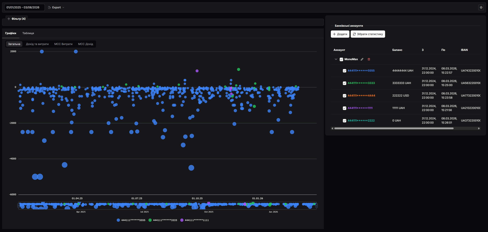

# Mimir Analytics

[Українська версія: README.UA.md](README.UA.md)

> Mímir is the Norse figure of wisdom and counsel.

**Mimir Analytics** is an open-source, self-hosted tool for local analysis of bank transactions. Connect your bank accounts, sync transactions, and explore your spending through charts and powerful filters — all on your own machine, with your data never leaving it.





> ⚠️ Do not expose port (default `42000`) to the open internet ⚠️

---

## Features

- 📥 **Bank integration** — Connects to banks (now only [Monobank](https://monobank.ua/) support) via its open API to pull transactions automatically.
- 💾 **Local SQLite storage** — All data is stored in a local `mimir.db` file. No cloud, no third parties.
- 📊 **Charts & analytics** — Visualize spending over time, by category, or by account.
- 🔍 **Advanced filters** — Filter transactions by date range, account, amount, currency, MCC category, description, and more. Combine filters with `AND`, `OR`, `AND NOT`, `OR NOT` combinators.
- 📤 **Export** — Download filtered transactions as **CSV**, **XLSX**, or **JSON**.
---

## Download and run

Pre-built binaries for **Windows** and **Linux** are available on the [releases page](https://github.com/IrwinJuice/mimir/releases).

### Windows

1. Download `mimir-windows-x86_64` from the [latest release](https://github.com/IrwinJuice/mimir/releases/latest).
2. Extract the archive.
3. Edit `Mimir.toml` to set your preferred port (default `42000`).
4. Run the executable:
   ```powershell
   .\mimir.exe
   ```
5. Open `http://localhost:42000` in your browser.

### Linux

1. Download `mimir-linux-x86_64` from the [latest release](https://github.com/IrwinJuice/mimir/releases/latest).
2. Extract the archive:
   ```bash
   tar -xzf mimir-linux-x86_64.tar.gz
   cd mimir
   ```
3. Edit `Mimir.toml` to set your preferred port (default `42000`).
4. Make the binary executable and run it:
   ```bash
   chmod +x mimir
   ./mimir
   ```
5. Open `http://localhost:42000` in your browser.


## Tech Stack

| Layer     | Technology                          |
|-----------|-------------------------------------|
| Backend   | Rust, [Axum](https://github.com/tokio-rs/axum), Tokio |
| Database  | SQLite via [SQLx](https://github.com/launchbadge/sqlx) |
| Frontend  | Angular (served as static files from `./static`) |

---

## Developer Guide

### Prerequisites

> For frontend see https://github.com/IrwinJuice/mimir-client

- [Rust](https://www.rust-lang.org/tools/install) (edition 2024)
- A [Monobank API token](https://api.monobank.ua/) (free, available in the Monobank app)

### Build & Run

```bash
# Clone the repository
git clone https://github.com/your-username/mimir.git
cd mimir

# Build in release mode
cargo build --release

# Run
./target/release/mimir
```

The server starts at `http://localhost:42000` by default.  
Open `http://localhost:42000` in your browser to access the UI.

### Configuration

Edit `Mimir.toml` to change the listening port:

```toml
[service]
port = 42000
```

---

## Project Structure

```
src/
├── main.rs               # Server setup, routing
├── config.rs             # Configuration loading (Mimir.toml)
├── mcc_data.rs           # MCC code lookup
├── ws_handler.rs         # WebSocket real-time updates
├── account/
│   ├── handler.rs        # Account HTTP handlers
│   ├── model.rs          # Account data models
│   └── repository.rs     # Account DB queries
├── transaction/
│   ├── handler.rs        # Transaction HTTP handlers (query, export)
│   ├── model.rs          # Transaction models & filter structs
│   └── repository.rs     # Transaction DB queries with dynamic filtering
└── utils/
    └── datetime.rs       # Date/time helpers
```

---

### Running in Development Mode

**Backend** (hot-reload with `cargo-watch`):

```bash
cargo install cargo-watch
cargo watch -x run
```

The backend listens on `http://localhost:42000`.

### Database

Migrations are managed by SQLx and run automatically on startup from the `migrations/` directory.

Migration files follow the naming convention `NNN_description.sql`.

### Logging & Tracing

Log level is controlled via the `RUST_LOG` environment variable:

```bash
# Windows (PowerShell)
$env:RUST_LOG = "debug"
cargo run

# Linux / macOS
RUST_LOG=debug cargo run
```
---

## Contributing

Contributions are welcome! Please follow the guidelines below to keep the project history clean and consistent.

### Commit Messages

This project uses [Conventional Commits](https://www.conventionalcommits.org/en/v1.0.0/).  
Every commit message must follow the format:

```
<type>[optional scope]: <description>

[optional body]

[optional footer(s)]
```

**Common types:**

| Type | When to use |
|------|-------------|
| `feat` | A new feature |
| `fix` | A bug fix |
| `docs` | Documentation changes only |
| `refactor` | Code change that neither fixes a bug nor adds a feature |
| `perf` | Performance improvement |
| `test` | Adding or updating tests |
| `chore` | Build process, dependency updates, tooling |
| `ci` | CI/CD configuration changes |

**Examples:**

```
feat(transaction): add XLSX export support
fix(account): handle missing token gracefully
docs: add contribution guide
chore: update sqlx to 0.8
```

Breaking changes must be marked with a `!` after the type/scope or with a `BREAKING CHANGE:` footer:

```
feat(api)!: rename /bills endpoint to /transactions
```

### Branching

- `main` — stable, production-ready code
- `feat/<short-description>` — new features
- `fix/<short-description>` — bug fixes

### Pull Requests

1. Fork the repository and create your branch from `main`.
2. Make sure the project builds without errors: `cargo build`.
3. Run `cargo clippy` and resolve any warnings.
4. Format your code with `cargo fmt`.
5. Open a Pull Request with a clear description of what was changed and why.

---

## License

See [LICENSE.md](LICENSE.md).
